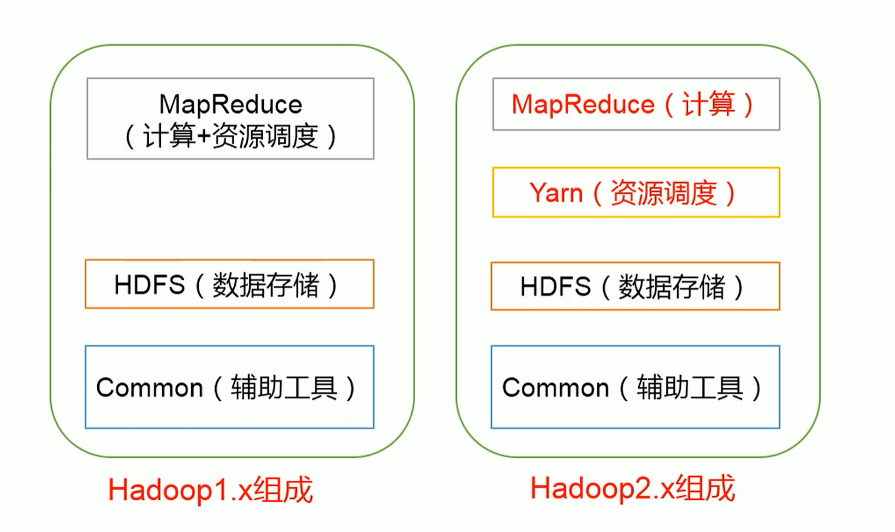
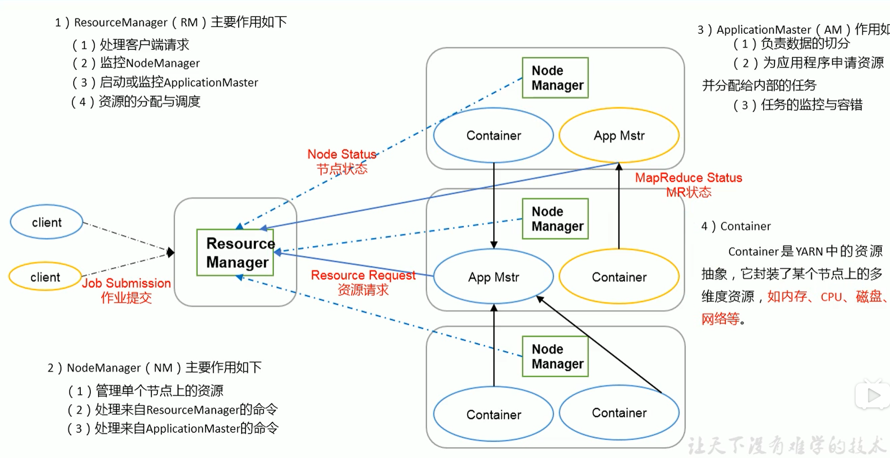

## 一、Hadoop是什么

#### Hadoop是一个由Apache基金会所开发的[分布式系统](https://baike.baidu.com/item/分布式系统/4905336)基础架构

 

## 二、Hadoop优势

**1.高可靠性**:Hadoop按位存储和处理数据的能力值得人们信赖。

**2.高扩展性**:Hadoop是在可用的计算机集簇间分配数据并完成计算任务的，这些集簇可以方便地扩展到数以千计的节点中。

**3.高效性**:Hadoop能够在节点之间动态地移动数据，并保证各个节点的动态平衡，因此处理速度非常快。

**4.高容错性**:Hadoop能够自动保存数据的多个副本，并且能够自动将失败的任务重新分配。

**5.低成本**:与一体机、商用数据仓库以及QlikView、Yonghong Z-Suite等数据集市相比，hadoop是开源的，项目的软件成本因此会大大降低。

 

### 三、Hadoop 1.x 和 Hadoop 2.x的区别

 

## 四、Hadoop组成

#### 1.HDFS架构

##### 

#### 2.Yarn架构

#### 3.MapReduce架构

##### (1):Map阶段并行处理输入数据

##### (2)Reduce阶段对Map结果进行汇总

 

## Hadoop目录结构

**1.bin**：bin目录是Hadoop最基本的管理脚本和使用脚本所在的目录，这些脚本是sbin目录下管理脚本的基础实现，用户可以直接使用这些脚本管理和使用Hadoop

**2.etc**：Hadoop配置文件所在的目录，包括：core-site.xml、hdfs-site.xml、mapred-site.xml和yarn-site.xml等配置文件。
**3.include**：对外提供的编程库头文件（具体的动态库和静态库在lib目录中），这些文件都是用C++定义的，通常用于C++程序访问HDFS或者编写MapReduce程序。
**4.lib**：包含了Hadoop对外提供的编程动态库和静态库，与include目录中的头文件结合使用。
**5.libexec**：各个服务对应的shell配置文件所在的目录，可用于配置日志输出目录、启动参数（比如JVM参数）等基本信息。
**6.sbin**：Hadoop管理脚本所在目录，主要包含HDFS和YARN中各类服务启动/关闭的脚本。
**7.share**：Hadoop各个模块编译后的Jar包所在目录，这个目录中也包含了Hadoop文档。

